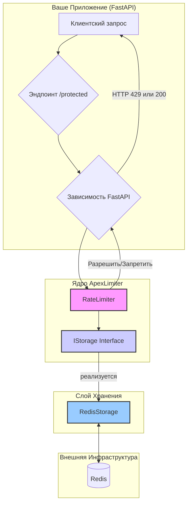

# Apex Rate Limiter

[](https://www.python.org/downloads/)
[](https://opensource.org/licenses/MIT)
[](https://github.com/psf/black)
[](http://mypy-lang.org/)

**ApexLimiter** — это высокопроизводительная, масштабируемая библиотека для ограничения частоты запросов (Rate Limiting), разработанная на Python с использованием `asyncio` и Redis. Она реализует один из самых эффективных и точных алгоритмов — **Sliding Window Counter**, что делает ее идеальным решением для защиты высоконагруженных API и сервисов.

## Ключевые особенности

-   🚀 **Высокая производительность:** Минимальные задержки благодаря асинхронной архитектуре и атомарным операциям в Redis.
-   🌐 **Горизонтальная масштабируемость:** Состояние хранится в Redis, что позволяет без проблем запускать множество экземпляров приложения за балансировщиком нагрузки.
-   🎯 **Точность:** Алгоритм Sliding Window Counter обеспечивает справедливое и точное ограничение, решая проблему "всплесков" на границах временных окон, свойственную более простым алгоритмам.
-   🏗️ **Чистая архитектура:** Четкое разделение слоев (логика, хранение, интеграция с фреймворком) делает код тестируемым, поддерживаемым и расширяемым.
-   🔒 **Надежность:** Атомарные транзакции в Redis гарантируют отсутствие состояний гонки (race conditions) при одновременных запросах.
-   ✨ **Полная типизация:** 100% покрытие типов и строгая проверка с помощью `mypy --strict` для максимальной надежности кода.

## Архитектура и Принцип Работы

В основе ApexLimiter лежат три ключевых концепции: чистая архитектура, эффективный алгоритм и внешнее хранилище состояния.



### 1. Алгоритм: Sliding Window Counter

Мы не просто считаем запросы за последнюю минуту. Мы используем **скользящее окно**. Представьте, что для каждого пользователя мы храним точные временные метки всех его недавних запросов.

Когда приходит новый запрос:
1.  Мы смотрим на временное окно (например, последние 60 секунд).
2.  **Удаляем все метки, которые старше этого окна.**
3.  **Добавляем метку текущего запроса.**
4.  **Считаем, сколько меток осталось.**
5.  Если количество меток меньше или равно лимиту, запрос разрешен. Иначе — отклонен.

Это реализовано чрезвычайно эффективно с помощью структуры данных **Redis Sorted Set (ZSET)**. Каждая временная метка — это `score` в ZSET. Все пять шагов выполняются как **одна атомарная транзакция** в Redis с помощью команд `ZREMRANGEBYSCORE`, `ZADD` и `ZCARD`. Это гарантирует производительность и отсутствие гонок данных.

### 2. Компоненты (Чистая Архитектура)

-   `core/rules.py`: `RateLimitRule` — простой и неизменяемый объект для описания правил (e.g., 100 запросов в 60 секунд).
-   `storage/base.py`: `IStorage` — это *интерфейс* (протокол), который определяет, что должно уметь любое хранилище. Это позволяет легко заменить Redis на что-то другое (например, Memcached или базу данных) в будущем, не меняя основную логику.
-   `storage/redis.py`: `RedisStorage` — конкретная реализация интерфейса `IStorage`, которая "разговаривает" с Redis.
-   `core/limiter.py`: `RateLimiter` — мозг системы. Он ничего не знает о Redis или FastAPI. Он просто берет правила и идентификатор пользователя, обращается к `IStorage` и принимает решение.
-   `framework/fastapi.py`: Адаптер, который "женит" наш `RateLimiter` с фреймворком FastAPI, используя его систему внедрения зависимостей (Dependency Injection).

## Установка и Запуск

### Требования

-   Python 3.10+
-   [Poetry](https://python-poetry.org/docs/#installation) для управления зависимостями.
-   Работающий сервер [Redis](https://redis.io/docs/getting-started/).

### Шаг 1: Клонирование и установка зависимостей

```bash
# Клонируйте репозиторий
git clone <your-repo-url>
cd apex-limiter

# Установите основные зависимости и зависимости для FastAPI
poetry install --extras "fastapi"
```

### Шаг 2: Конфигурация

Создайте файл `.env` в корневом каталоге проекта и укажите в нем путь к вашему Redis серверу.

**.env**
```env
REDIS_URL="redis://localhost:6379/0"
```

### Шаг 3: Запуск демо-приложения

Теперь можно запустить веб-сервер с примером приложения:

```bash
poetry run uvicorn app.main:app --reload
```

Сервер будет доступен по адресу `http://127.0.0.1:8000`.

## Как это работает: Тестирование вживую

Откройте терминал и попробуйте отправить запросы на разные эндпоинты.

1.  **Публичный эндпоинт (без лимитов)**
    ```bash
    curl http://127.0.0.1:8000/
    # Вывод: {"message":"This route is public and has no rate limits."}
    ```

2.  **Защищенный эндпоинт (лимит: 5 запросов / 10 секунд)**

    Выполните следующую команду, которая отправит 6 запросов подряд:
    ```bash
    for i in {1..6}; do curl -i http://127.0.0.1:8000/protected; echo ""; done
    ```

    Вы увидите, что первые 5 запросов получают ответ `HTTP/1.1 200 OK`, а шестой — `HTTP/1.1 429 Too Many Requests`.

    **Успешный ответ (первые 5):**
    ```http
    HTTP/1.1 200 OK
    ...
    {"message":"You can access this 5 times every 10 seconds.","rules":[[5,{"__timedelta__":true,"days":0,"microseconds":0,"seconds":10}]]}
    ```

    **Отклоненный ответ (6-й и далее):**
    ```http
    HTTP/1.1 429 Too Many Requests
    ...
    {"detail":"Too Many Requests"}
    ```

    Подождите 10 секунд, и вы снова сможете делать запросы.

## Запуск тестов

Проект имеет высокий уровень тестового покрытия. Для запуска тестов выполните:

```bash
poetry run pytest
```

Тесты используют `fakeredis` для эмуляции Redis в памяти, поэтому для их запуска не требуется реальный сервер Redis.

## Структура проекта

```
apex-limiter/
├── app/                  # Демо-приложение на FastAPI
│   ├── main.py           # Точка входа, эндпоинты
│   └── config.py         # Конфигурация (Pydantic)
├── src/
│   └── apex_limiter/     # Исходный код самой библиотеки
│       ├── core/         # Ядро: бизнес-логика, независимая от фреймворков
│       │   ├── limiter.py
│       │   └── rules.py
│       ├── storage/      # Слой хранения данных
│       │   ├── base.py   # Абстрактный интерфейс хранилища
│       │   └── redis.py  # Реализация для Redis
│       └── framework/    # Адаптеры для интеграции с веб-фреймворками
│           └── fastapi.py
├── tests/                # Тесты
│   ├── conftest.py       # Общие фикстуры (например, fake_redis)
│   ├── core/             # Unit-тесты для ядра
│   └── storage/          # Integration-тесты для хранилища
├── .env.example          # Пример файла конфигурации
├── .gitignore
├── pyproject.toml        # Описание проекта и зависимостей (Poetry)
└── README.md             # Этот файл
```

## Возможные улучшения и дальнейшее развитие

-   [ ] **Стратегия Fail-Open / Fail-Close:** Добавить опцию, как вести себя при недоступности Redis (пропускать все запросы или блокировать).
-   [ ] **Гибкое извлечение идентификатора:** Позволить пользователю передавать кастомную функцию для получения ID клиента (например, из JWT токена или API-ключа).
-   [ ] **Поддержка других хранилищ:** Реализовать `MemcachedStorage` или `SQLAlchemyStorage`, следуя интерфейсу `IStorage`.
-   [ ] **Мониторинг:** Интегрировать метрики (например, для Prometheus), чтобы отслеживать количество заблокированных запросов.
-   [ ] **Динамические правила:** Реализовать возможность загружать и изменять правила "на лету" из базы данных или сервиса конфигурации.

---
